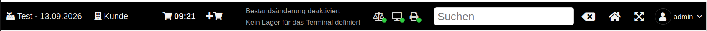
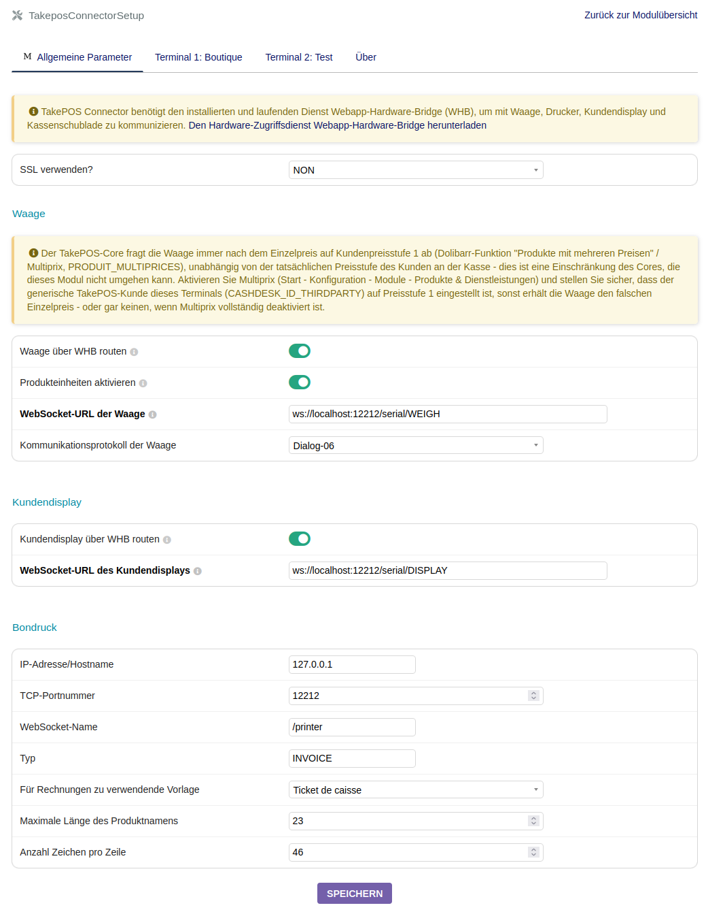

# TAKEPOSCONNECTOR FÜR [DOLIBARR ERP CRM](https://www.dolibarr.org)

## Funktionen

Die Hauptfunktion des Moduls **TakePOSConnector** besteht darin, **TakePOS** die Nutzung
folgender Hardware zu ermöglichen:
- Waage
- Bondrucker
- Kundendisplay
- Kassenschublade

Es unterstützt mehrere Übertragungsarten/Protokolle für die Kommunikation mit dieser Hardware:
- **Dialog-06-Protokoll** für Waagen, die einen expliziten Anfrage-/Antwort-Austausch (Gewicht
  + Einzelpreis) statt eines kontinuierlichen Gewichtsstroms benötigen.
- **Kontinuierliche Gewichtsübertragung** (ältere/einfachere Waagenprotokolle).
- **ESC/POS-Thermodrucker** über die Webapp-Hardware-Bridge (WHB), einschließlich roher
  Binärausgabe für Bons.

Weitere Funktionen:
- **Terminal-Konfiguration mit Vererbung**: Jeder Parameter (WebSocket-URL von Waage/Display,
  Druckerverbindung, Bonbreite usw.) besitzt einen **gemeinsamen Wert**, der von allen
  Terminals geteilt wird, und kann optional **pro Terminal überschrieben** werden — über eine
  Einrichtungsseite mit Reitern, ohne dieselben Einstellungen an jeder Kasse zu wiederholen.
- **Statusanzeigen der Hardwareverbindungen** in der oberen Leiste von TakePOS (Waage,
  Kundendisplay, Drucker, Kassenschublade), mit automatischer WebSocket-Wiederverbindung.

- **Konfigurierbare Bonbreite** (Zeichen pro Zeile), pro Terminal, um schmale Thermodrucker
  (z. B. 42 Spalten) statt der Standardbreite von 48 Spalten zu unterstützen.

## Kompatibilität

**Dolibarr >= 24.0.1 ist für Waage und Kundendisplay über die Webapp-Hardware-Bridge (WHB)
erforderlich.** Der Core erhielt das WHB-Routing für diese beiden Geräte erst in Version
24.0.1 (`TAKEPOS_CONNECTOR_TO_WHB_SCALE` / `TAKEPOS_CONNECTOR_TO_WHB_CUSTOMER_DISPLAY`). In
jeder früheren Version verfügt der TakePOS-Core über keinen derartigen Mechanismus — Waage und
Kundendisplay greifen unabhängig von der Konfiguration dieses Moduls immer auf einen direkten
HTTP-Aufruf an `TAKEPOS_PRINT_SERVER` zurück, ohne Möglichkeit, den WHB-/WebSocket-Weg zu
aktivieren.

Thermodrucker und Kassenschublade über WHB hängen nicht von diesem Core-Routing ab und
funktionieren auch mit früheren Dolibarr-Versionen.

## Voraussetzungen

- der **New TakePOS Connector PHP**, um das Waagenprotokoll "$", den Thermodrucker, die
  Kassenschublade und das Kundendisplay zu nutzen
- die **Webapp-Hardware-Bridge**, um die kontinuierliche Gewichtsübertragung oder das
  Dialog-06-Protokoll für die Waage, den ESC-POS-Thermodrucker, das Kundendisplay und die
  Kassenschublade zu nutzen

## Modulkonfiguration

#### Allgemein

- Das Modul takeposconnector installieren von: <https://github.com/LePat/takeposconnector>
- Das Modul takeposconnector aktivieren.
- Den Parameter `TAKEPOS_PRINT_METHOD` hinzufügen, Wert = `takeposconnector`
- Den Druckserver festlegen, indem der Parameter `TAKEPOS_PRINT_SERVER` hinzugefügt wird,
  Wert = `http://localhost:12212`
- Das Kundendisplay aktivieren, indem der Parameter `TAKEPOS_CUSTOMER_DISPLAY` hinzugefügt
  wird, Wert = `1`
- Die Waage aktivieren, indem der Parameter `TAKEPOS_WEIGHING_SCALE` hinzugefügt wird,
  Wert = `1`

#### Verwendung des New TakePOS Connector PHP

Er lauscht auf HTTP-Anfragen an Port 12212.

Den New TakePOS Connector PHP installieren von:
<https://github.com/andreubisquerra/TakePOS-connector-PHP>

Er sollte mit der obigen allgemeinen Konfiguration funktionieren, da das Modul
takeposconnector standardmäßig den New TakePOS Connector PHP verwendet:
- `/print/index.php` wird an die URL (`TAKEPOS_PRINT_SERVER`) angehängt, um sich mit dem
  Drucker zu verbinden
- `/print/drawer.php` wird an die URL (`TAKEPOS_PRINT_SERVER`) angehängt, um sich mit der
  Kassenschublade zu verbinden
- `/display/index.php` wird an die URL (`TAKEPOS_PRINT_SERVER`) angehängt, um sich mit dem
  Kundendisplay zu verbinden
- `/scale/index.php` wird an die URL (`TAKEPOS_PRINT_SERVER`) angehängt, um sich mit der Waage
  zu verbinden

#### Verwendung der Webapp-Hardware-Bridge

Sie öffnet WebSockets an Port 12212.

Die Webapp-Hardware-Bridge (WHB) installieren von:
<https://github.com/LePat/webapp-hardware-bridge>

takeposconnector so konfigurieren, dass TakePOS die WHB verwendet:
- Webservice der Waage: `ws://127.0.0.1:12212/serial/WEIGH` (oder
  `ws://127.0.0.1:12212/takepos` für Tests)
- Webservice des Kundendisplays: `ws://127.0.0.1:12212/serial/DISPLAY` (zum Testen in der
  whb-console den Befehl `socat` ausführen und ihn in der WHB-Oberfläche einrichten)
- Thermodrucker, für jedes in TakePOS definierte Terminal:
  - Verwendung von SSL für WebSockets
  - Hostname (`DIRECTPRINTWHB_IPADDRESS`): `127.0.0.1`
  - TCP-Port (`DIRECTPRINTWHB_PORT`): `12212`
  - Webservice-Name (`DIRECTPRINTWHB_TPPRINTERID`): `/print/INVOICE` (oder `/posprinter` für
    Tests in der whb-console)

#### Verwendung des TakePOS Connector Java

Er lauscht auf HTTP-Anfragen an Port 8111.

Den TakePOS Connector Java installieren von:
<https://github.com/andreubisquerra/TakePOS-Connector-Java>

In diesem Fall den Wert des Parameters `TAKEPOS_PRINT_SERVER` auf `localhost` oder
`127.0.0.1` ändern; die URL wird mit `FILTER_VALIDATE_URL` gefiltert, um zu bestimmen, ob sie
vollständig ist. Ist sie es nicht, wird sie wie folgt vervollständigt:
`http://<TAKEPOS_PRINT_SERVER>:8111/print`. In diesem Fall wird nur der Drucker verwaltet.

#### Screenshot der Konfiguration des Moduls TakePOSConnector



> Hinweis: Dieser Screenshot stammt aus der Zeit vor der Einrichtungsseite mit Reitern pro
> Terminal und muss aktualisiert werden.

## Danksagung

Dieses Modul ist ein Fork des ursprünglichen Dolibarr-Moduls
[TakePOS-Connector](https://github.com/andreubisquerra/TakePOS-Connector) von Andreu
Bisquerra, das nun unabhängig weiterentwickelt wird. Die ursprünglichen Copyright-Hinweise
bleiben in den betreffenden Quelldateien erhalten.

## Sonstiges

TakePOS Connector (dieses Modul), TakePOS Connector Java und New TakePOS Connector PHP haben
unterschiedliche Einsatzzwecke.

Weitere externe Module sind auf [Dolistore.com](https://www.dolistore.com) verfügbar.

## Übersetzungen

Übersetzungen können manuell durch Bearbeiten der Dateien in den Verzeichnissen *langs*
vervollständigt werden.

Dieses Modul enthält außerdem eine Beispielkonfiguration für Transifex im versteckten
Verzeichnis [.tx](.tx), sodass Übersetzungen über diesen Dienst verwaltet werden können.

Weitere Informationen finden Sie in der
[Dokumentation für Übersetzer](https://wiki.dolibarr.org/index.php/Translator_documentation).

Für dieses Modul gibt es ein
[Transifex-Projekt](https://transifex.com/projects/p/dolibarr-module-template).

## Installation

### Aus der ZIP-Datei und der grafischen Oberfläche

- Wenn Sie das Modul als ZIP-Datei erhalten haben (z. B. beim Herunterladen aus dem
  Marktplatz [Dolistore](https://www.dolistore.com)), gehen Sie zum Menü
  `Start - Konfiguration - Module - Externes Modul bereitstellen` und laden Sie die ZIP-Datei
  hoch.

Hinweis: Wenn diese Ansicht angibt, dass kein Verzeichnis custom vorhanden ist, prüfen Sie,
ob Ihre Konfiguration korrekt ist:

- Bearbeiten Sie in Ihrem Dolibarr-Installationsverzeichnis die Datei
  `htdocs/conf/conf.php` und prüfen Sie, dass die folgenden Zeilen nicht auskommentiert sind:

    ```php
    //$dolibarr_main_url_root_alt ...
    //$dolibarr_main_document_root_alt ...
    ```

- Kommentieren Sie sie bei Bedarf ein (löschen Sie das führende `//`) und weisen Sie ihnen
  einen zu Ihrer Dolibarr-Installation passenden Wert zu

    Zum Beispiel:

    - UNIX:
        ```php
        $dolibarr_main_url_root_alt = '/custom';
        $dolibarr_main_document_root_alt = '/var/www/Dolibarr/htdocs/custom';
        ```

    - Windows:
        ```php
        $dolibarr_main_url_root_alt = '/custom';
        $dolibarr_main_document_root_alt = 'C:/My Web Sites/Dolibarr/htdocs/custom';
        ```

### Aus einem GIT-Repository

- Das Repository nach `$dolibarr_main_document_root_alt/takeposconnector` klonen

```sh
cd ....../custom
git clone git@github.com:gitlogin/takeposconnector.git takeposconnector
```

### <a name="final_steps"></a>Letzte Schritte

In Ihrem Browser:

  - Melden Sie sich bei Dolibarr als Super-Administrator an
  - Gehen Sie zu "Konfiguration" -> "Module"
  - Sie sollten das Modul nun finden und aktivieren können


## Lizenzen

### Hauptcode

GPLv3 oder (nach Ihrer Wahl) jede spätere Version. Weitere Informationen finden Sie in der
Datei COPYING.

### Dokumentation

Alle Texte und Readme-Dateien stehen unter der GFDL-Lizenz.
