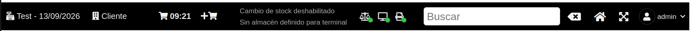
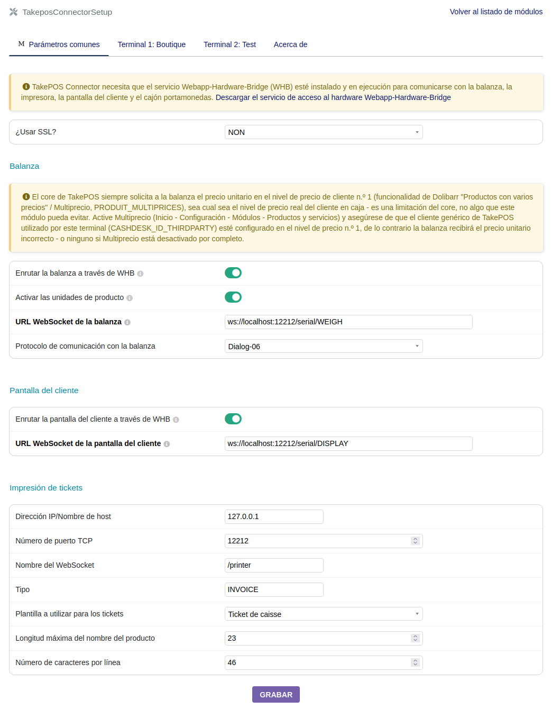

# TAKEPOSCONNECTOR PARA [DOLIBARR ERP CRM](https://www.dolibarr.org)

## Funcionalidades

La función principal del módulo **TakePOSConnector** es permitir que **TakePOS** utilice el
siguiente hardware:
- balanza
- impresora térmica
- pantalla del cliente
- cajón portamonedas

Es compatible con varios transportes/protocolos para comunicarse con ese hardware:
- **Protocolo Dialog-06**, para balanzas que requieren un intercambio explícito de
  solicitud/respuesta (peso + precio unitario) en lugar de un flujo continuo de peso.
- **Transmisión continua del peso** (protocolos de balanza más antiguos/sencillos).
- **Impresoras térmicas ESC/POS** a través del Webapp-Hardware-Bridge (WHB), incluida la
  salida binaria bruta para los tickets.

Otras funcionalidades:
- **Configuración por terminal con herencia**: cada parámetro (URL WebSocket de la balanza y
  de la pantalla, conexión de la impresora, ancho del ticket, etc.) tiene un **valor común**
  compartido por todos los terminales, y opcionalmente puede **sobrescribirse por terminal**
  desde una página de configuración con pestañas — sin necesidad de repetir los mismos ajustes
  en cada caja.
- **Indicadores de estado de las conexiones de hardware** en la barra superior de TakePOS
  (balanza, pantalla del cliente, impresora, cajón portamonedas), con reconexión automática
  del WebSocket.

- **Ancho de ticket configurable** (número de caracteres por línea), por terminal, para
  adaptarse a impresoras térmicas estrechas (por ejemplo, 42 columnas) en lugar del valor por
  defecto de 48 columnas.

## Compatibilidad

**Se requiere Dolibarr >= 24.0.1 para la balanza y la pantalla del cliente a través del
Webapp-Hardware-Bridge (WHB).** El core solo incorporó el enrutamiento WHB para estos dos
dispositivos en la versión 24.0.1 (`TAKEPOS_CONNECTOR_TO_WHB_SCALE` /
`TAKEPOS_CONNECTOR_TO_WHB_CUSTOMER_DISPLAY`). En cualquier versión anterior, el core de
TakePOS no dispone de ningún mecanismo de este tipo — la balanza y la pantalla del cliente
siempre recurren a una llamada HTTP directa a `TAKEPOS_PRINT_SERVER`, sea cual sea la
configuración de este módulo, sin posibilidad de activar la vía WHB/WebSocket.

La impresora térmica y el cajón portamonedas a través de WHB no dependen de ese enrutamiento
del core y también funcionan en versiones anteriores de Dolibarr.

## Requisitos

- el **New TakePOS Connector PHP** para utilizar el protocolo de balanza "$", la impresora
  térmica, el cajón portamonedas y la pantalla del cliente
- el **Webapp-Hardware-Bridge** para utilizar la transmisión continua del peso o el protocolo
  Dialog-06 para la balanza, la impresora térmica ESC-POS, la pantalla del cliente y el cajón
  portamonedas

## Configuración del módulo

#### General

- Instalar el módulo takeposconnector desde: <https://github.com/LePat/takeposconnector>
- Activar el módulo takeposconnector.
- Añadir el parámetro `TAKEPOS_PRINT_METHOD`, valor = `takeposconnector`
- Definir el servidor de impresión añadiendo el parámetro `TAKEPOS_PRINT_SERVER`, valor =
  `http://localhost:12212`
- Activar la pantalla del cliente añadiendo el parámetro `TAKEPOS_CUSTOMER_DISPLAY`, valor =
  `1`
- Activar la balanza añadiendo el parámetro `TAKEPOS_WEIGHING_SCALE`, valor = `1`

#### Uso del New TakePOS Connector PHP

Escucha peticiones HTTP en el puerto 12212.

Instalar el New TakePOS Connector PHP desde:
<https://github.com/andreubisquerra/TakePOS-connector-PHP>

Debería funcionar con la configuración general anterior, ya que el módulo takeposconnector
utiliza por defecto el New TakePOS Connector PHP:
- se añade `/print/index.php` a la URL (`TAKEPOS_PRINT_SERVER`) para conectar con la impresora
- se añade `/print/drawer.php` a la URL (`TAKEPOS_PRINT_SERVER`) para conectar con el cajón
  portamonedas
- se añade `/display/index.php` a la URL (`TAKEPOS_PRINT_SERVER`) para conectar con la
  pantalla del cliente
- se añade `/scale/index.php` a la URL (`TAKEPOS_PRINT_SERVER`) para conectar con la balanza

#### Uso del Webapp-Hardware-Bridge

Abre WebSockets en el puerto 12212.

Instalar el Webapp-Hardware-Bridge (WHB) desde:
<https://github.com/LePat/webapp-hardware-bridge>

Configurar takeposconnector para que TakePOS utilice el WHB:
- Webservice de la balanza: `ws://127.0.0.1:12212/serial/WEIGH` (o
  `ws://127.0.0.1:12212/takepos` para pruebas)
- Webservice de la pantalla del cliente: `ws://127.0.0.1:12212/serial/DISPLAY` (para probarlo
  en la whb-console, ejecute el comando `socat` y configúrelo en la interfaz gráfica de WHB)
- Impresora térmica, para cada terminal definido en TakePOS:
  - uso de SSL para los WebSockets
  - nombre de host (`DIRECTPRINTWHB_IPADDRESS`): `127.0.0.1`
  - puerto TCP (`DIRECTPRINTWHB_PORT`): `12212`
  - nombre del webservice (`DIRECTPRINTWHB_TPPRINTERID`): `/print/INVOICE` (o `/posprinter`
    para pruebas en la whb-console)

#### Uso del TakePOS Connector Java

Escucha peticiones HTTP en el puerto 8111.

Instalar el TakePOS Connector Java desde:
<https://github.com/andreubisquerra/TakePOS-Connector-Java>

En este caso, cambie el valor del parámetro `TAKEPOS_PRINT_SERVER` a `localhost` o
`127.0.0.1`; la URL se filtra con `FILTER_VALIDATE_URL` para determinar si está completa o no.
Si no lo está, se completará así: `http://<TAKEPOS_PRINT_SERVER>:8111/print`. En este caso solo
se gestiona la impresora.

#### Captura de pantalla de la configuración del módulo TakePOSConnector



> Nota: esta captura de pantalla es anterior a la página de configuración con pestañas por
> terminal y debe actualizarse.

## Créditos

Este módulo es un fork del módulo Dolibarr original
[TakePOS-Connector](https://github.com/andreubisquerra/TakePOS-Connector) de Andreu
Bisquerra, mantenido ahora de forma independiente. Los avisos de copyright originales se
conservan en los archivos fuente correspondientes.

## Varios

TakePOS Connector (este), TakePOS Connector Java y New TakePOS Connector PHP tienen usos
diferentes.

Hay otros módulos externos disponibles en [Dolistore.com](https://www.dolistore.com).

## Traducciones

Las traducciones pueden completarse manualmente editando los archivos de los directorios
*langs*.

Este módulo también contiene un ejemplo de configuración para Transifex, en el directorio
oculto [.tx](.tx), lo que permite gestionar las traducciones mediante este servicio.

Para más información, consulte la
[documentación del traductor](https://wiki.dolibarr.org/index.php/Translator_documentation).

Hay un [proyecto Transifex](https://transifex.com/projects/p/dolibarr-module-template) para
este módulo.

## Instalación

### Desde el archivo ZIP y la interfaz gráfica

- Si dispone del módulo en forma de archivo zip (por ejemplo, al descargarlo desde el
  marketplace [Dolistore](https://www.dolistore.com)), vaya al menú
  `Inicio - Configuración - Módulos - Desplegar un módulo externo` y suba el archivo zip.

Nota: si esta pantalla le indica que no existe un directorio custom, compruebe que su
configuración es correcta:

- En su directorio de instalación de Dolibarr, edite el archivo `htdocs/conf/conf.php` y
  compruebe que las siguientes líneas no están comentadas:

    ```php
    //$dolibarr_main_url_root_alt ...
    //$dolibarr_main_document_root_alt ...
    ```

- Descoméntelas si es necesario (elimine el `//` inicial) y asígneles un valor coherente con
  su instalación de Dolibarr

    Por ejemplo:

    - UNIX:
        ```php
        $dolibarr_main_url_root_alt = '/custom';
        $dolibarr_main_document_root_alt = '/var/www/Dolibarr/htdocs/custom';
        ```

    - Windows:
        ```php
        $dolibarr_main_url_root_alt = '/custom';
        $dolibarr_main_document_root_alt = 'C:/My Web Sites/Dolibarr/htdocs/custom';
        ```

### Desde un repositorio GIT

- Clone el repositorio en `$dolibarr_main_document_root_alt/takeposconnector`

```sh
cd ....../custom
git clone git@github.com:gitlogin/takeposconnector.git takeposconnector
```

### <a name="final_steps"></a>Pasos finales

Desde su navegador:

  - Inicie sesión en Dolibarr como superadministrador
  - Vaya a "Configuración" -> "Módulos"
  - Ahora debería poder encontrar y activar el módulo


## Licencias

### Código principal

GPLv3 o (a su elección) cualquier versión posterior. Consulte el archivo COPYING para más
información.

### Documentación

Todos los textos y archivos readme están bajo licencia GFDL.
