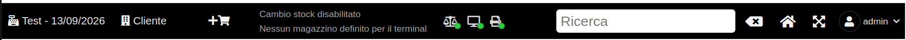
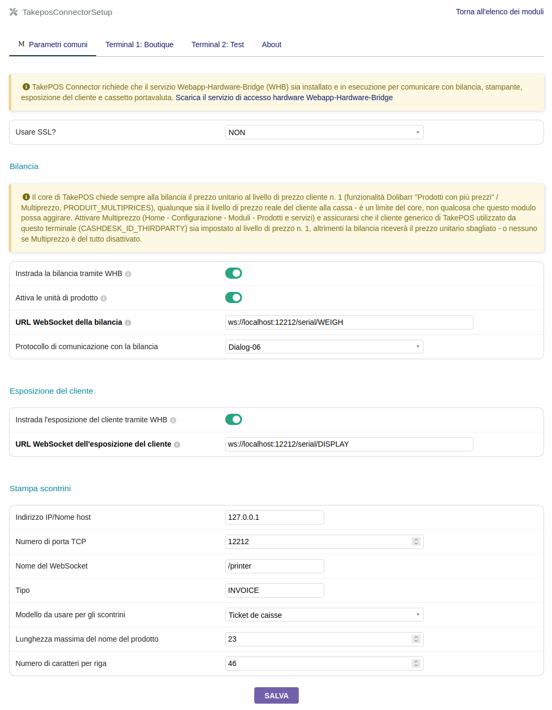

# TAKEPOSCONNECTOR PER [DOLIBARR ERP CRM](https://www.dolibarr.org)

## Funzionalità

La funzione principale del modulo **TakePOSConnector** è consentire a **TakePOS** di
utilizzare il seguente hardware:
- bilancia
- stampante termica
- esposizione del cliente
- cassetto portavaluta

Supporta diversi trasporti/protocolli per comunicare con questo hardware:
- **Protocollo Dialog-06**, per bilance che richiedono uno scambio esplicito di
  richiesta/risposta (peso + prezzo unitario) invece di un flusso continuo del peso.
- **Trasmissione continua del peso** (protocolli di bilancia più vecchi/semplici).
- **Stampanti termiche ESC/POS** tramite il Webapp-Hardware-Bridge (WHB), inclusa l'uscita
  binaria grezza per gli scontrini.

Altre funzionalità:
- **Configurazione per terminale con ereditarietà**: ogni parametro (URL WebSocket di
  bilancia/esposizione, connessione stampante, larghezza scontrino, ecc.) ha un **valore
  comune** condiviso da tutti i terminali, e può opzionalmente essere **sovrascritto per
  terminale** da una pagina di configurazione a schede — senza dover ripetere le stesse
  impostazioni su ogni cassa.
- **Indicatori di stato delle connessioni hardware** nella barra superiore di TakePOS
  (bilancia, esposizione del cliente, stampante, cassetto portavaluta), con riconnessione
  automatica del WebSocket.

- **Larghezza dello scontrino configurabile** (numero di caratteri per riga), per terminale,
  per adattarsi a stampanti termiche strette (ad es. 42 colonne) invece della larghezza
  predefinita di 48 colonne.

## Compatibilità

**Dolibarr >= 24.0.1 è richiesto per bilancia ed esposizione del cliente tramite il
Webapp-Hardware-Bridge (WHB).** Il core ha introdotto l'instradamento WHB per questi due
dispositivi solo nella versione 24.0.1 (`TAKEPOS_CONNECTOR_TO_WHB_SCALE` /
`TAKEPOS_CONNECTOR_TO_WHB_CUSTOMER_DISPLAY`). In qualsiasi versione precedente, il core di
TakePOS non dispone di alcun meccanismo di questo tipo — bilancia ed esposizione del cliente
ricorrono sempre a una chiamata HTTP diretta verso `TAKEPOS_PRINT_SERVER`, qualunque sia la
configurazione di questo modulo, senza possibilità di attivare la via WHB/WebSocket.

La stampante termica e il cassetto portavaluta tramite WHB non dipendono da questo
instradamento del core e funzionano anche su versioni precedenti di Dolibarr.

## Requisiti

- il **New TakePOS Connector PHP** per usare il protocollo bilancia "$", la stampante
  termica, il cassetto portavaluta e l'esposizione del cliente
- il **Webapp-Hardware-Bridge** per usare la trasmissione continua del peso o il protocollo
  Dialog-06 per la bilancia, la stampante termica ESC-POS, l'esposizione del cliente e il
  cassetto portavaluta

## Configurazione del modulo

#### Generale

- Installare il modulo takeposconnector da: <https://github.com/LePat/takeposconnector>
- Attivare il modulo takeposconnector.
- Aggiungere il parametro `TAKEPOS_PRINT_METHOD`, valore = `takeposconnector`
- Impostare il server di stampa aggiungendo il parametro `TAKEPOS_PRINT_SERVER`, valore =
  `http://localhost:12212`
- Attivare l'esposizione del cliente aggiungendo il parametro `TAKEPOS_CUSTOMER_DISPLAY`,
  valore = `1`
- Attivare la bilancia aggiungendo il parametro `TAKEPOS_WEIGHING_SCALE`, valore = `1`

#### Uso del New TakePOS Connector PHP

Ascolta le richieste HTTP sulla porta 12212.

Installare il New TakePOS Connector PHP da:
<https://github.com/andreubisquerra/TakePOS-connector-PHP>

Dovrebbe funzionare con la configurazione generale sopra indicata, poiché il modulo
takeposconnector utilizza per impostazione predefinita il New TakePOS Connector PHP:
- `/print/index.php` viene aggiunto all'URL (`TAKEPOS_PRINT_SERVER`) per connettersi alla
  stampante
- `/print/drawer.php` viene aggiunto all'URL (`TAKEPOS_PRINT_SERVER`) per connettersi al
  cassetto portavaluta
- `/display/index.php` viene aggiunto all'URL (`TAKEPOS_PRINT_SERVER`) per connettersi
  all'esposizione del cliente
- `/scale/index.php` viene aggiunto all'URL (`TAKEPOS_PRINT_SERVER`) per connettersi alla
  bilancia

#### Uso del Webapp-Hardware-Bridge

Apre WebSocket sulla porta 12212.

Installare il Webapp-Hardware-Bridge (WHB) da:
<https://github.com/LePat/webapp-hardware-bridge>

Configurare takeposconnector affinché TakePOS utilizzi il WHB:
- Webservice della bilancia: `ws://127.0.0.1:12212/serial/WEIGH` (o
  `ws://127.0.0.1:12212/takepos` per i test)
- Webservice dell'esposizione del cliente: `ws://127.0.0.1:12212/serial/DISPLAY` (per
  testarlo nella whb-console, eseguire il comando `socat` e configurarlo nell'interfaccia
  grafica di WHB)
- Stampante termica, per ogni terminale definito in TakePOS:
  - uso di SSL per i WebSocket
  - nome host (`DIRECTPRINTWHB_IPADDRESS`): `127.0.0.1`
  - porta TCP (`DIRECTPRINTWHB_PORT`): `12212`
  - nome del webservice (`DIRECTPRINTWHB_TPPRINTERID`): `/print/INVOICE` (o `/posprinter` per
    i test nella whb-console)

#### Uso del TakePOS Connector Java

Ascolta le richieste HTTP sulla porta 8111.

Installare il TakePOS Connector Java da:
<https://github.com/andreubisquerra/TakePOS-Connector-Java>

In questo caso, cambiare il valore del parametro `TAKEPOS_PRINT_SERVER` in `localhost` o
`127.0.0.1`; l'URL viene filtrata con `FILTER_VALIDATE_URL` per determinare se è completa o
meno. Se non lo è, verrà completata così: `http://<TAKEPOS_PRINT_SERVER>:8111/print`. In
questo caso viene gestita solo la stampante.

#### Screenshot della configurazione del modulo TakePOSConnector



> Nota: questo screenshot è precedente alla pagina di configurazione a schede per terminale e
> deve essere aggiornato.

## Crediti

Questo modulo è un fork del modulo Dolibarr originale
[TakePOS-Connector](https://github.com/andreubisquerra/TakePOS-Connector) di Andreu
Bisquerra, ora mantenuto in modo indipendente. Le note di copyright originali sono conservate
nei file sorgente interessati.

## Varie

TakePOS Connector (questo), TakePOS Connector Java e New TakePOS Connector PHP hanno scopi
diversi.

Altri moduli esterni sono disponibili su [Dolistore.com](https://www.dolistore.com).

## Traduzioni

Le traduzioni possono essere completate manualmente modificando i file nelle directory
*langs*.

Questo modulo contiene anche una configurazione di esempio per Transifex, nella directory
nascosta [.tx](.tx), che consente di gestire le traduzioni tramite questo servizio.

Per maggiori informazioni, consultare la
[documentazione per traduttori](https://wiki.dolibarr.org/index.php/Translator_documentation).

Esiste un [progetto Transifex](https://transifex.com/projects/p/dolibarr-module-template) per
questo modulo.

## Installazione

### Dal file ZIP e dall'interfaccia grafica

- Se si dispone del modulo come file zip (ad esempio scaricandolo dal marketplace
  [Dolistore](https://www.dolistore.com)), andare nel menu
  `Home - Configurazione - Moduli - Distribuisci un modulo esterno` e caricare il file zip.

Nota: se questa schermata indica che non esiste una directory custom, verificare che la
configurazione sia corretta:

- Nella directory di installazione di Dolibarr, modificare il file `htdocs/conf/conf.php` e
  verificare che le seguenti righe non siano commentate:

    ```php
    //$dolibarr_main_url_root_alt ...
    //$dolibarr_main_document_root_alt ...
    ```

- Decommentarle se necessario (eliminare il `//` iniziale) e assegnare loro un valore
  coerente con la propria installazione di Dolibarr

    Ad esempio:

    - UNIX:
        ```php
        $dolibarr_main_url_root_alt = '/custom';
        $dolibarr_main_document_root_alt = '/var/www/Dolibarr/htdocs/custom';
        ```

    - Windows:
        ```php
        $dolibarr_main_url_root_alt = '/custom';
        $dolibarr_main_document_root_alt = 'C:/My Web Sites/Dolibarr/htdocs/custom';
        ```

### Da un repository GIT

- Clonare il repository in `$dolibarr_main_document_root_alt/takeposconnector`

```sh
cd ....../custom
git clone git@github.com:gitlogin/takeposconnector.git takeposconnector
```

### <a name="final_steps"></a>Passaggi finali

Dal proprio browser:

  - Accedere a Dolibarr come super-amministratore
  - Andare in "Configurazione" -> "Moduli"
  - Ora dovrebbe essere possibile trovare e attivare il modulo


## Licenze

### Codice principale

GPLv3 o (a propria scelta) qualsiasi versione successiva. Consultare il file COPYING per
maggiori informazioni.

### Documentazione

Tutti i testi e i file readme sono concessi in licenza GFDL.
