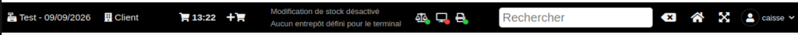
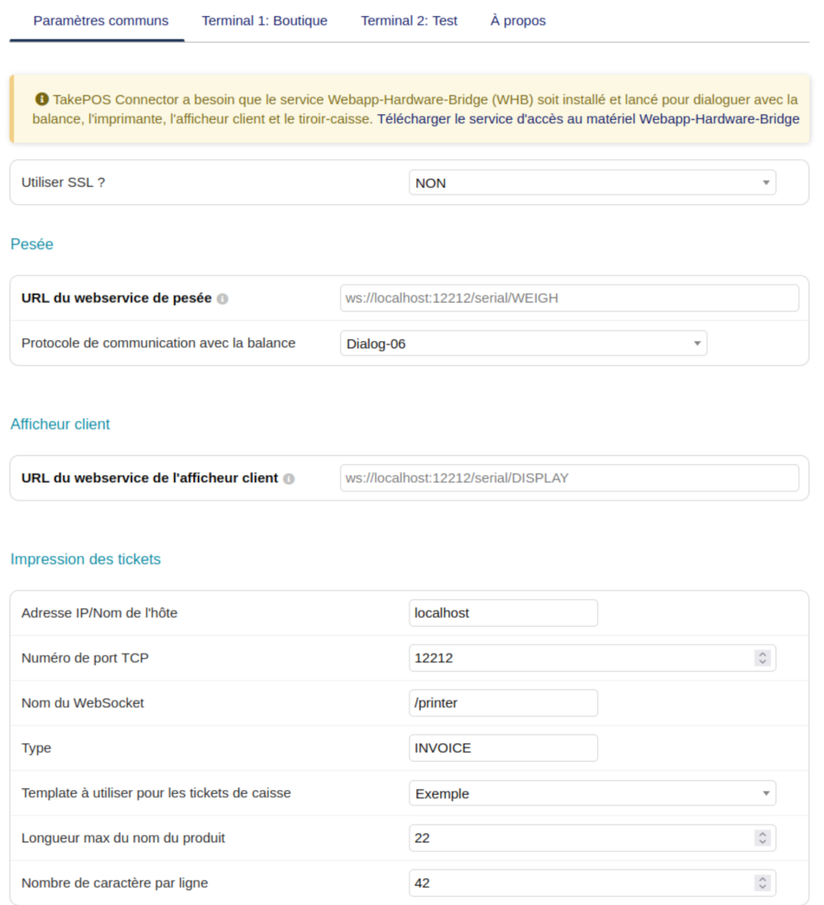

# TAKEPOSCONNECTOR FOR [DOLIBARR ERP CRM](https://www.dolibarr.org)

## Features

The TakePOSConnector module's main feature is to allow TakePOS to use the following hardware:
- weighing scale
- thermal printer
- customer display
- cash drawer

It supports several transports/protocols to talk to that hardware:
- **Dialog-06 protocol** for weighing scales that require an explicit request/response exchange (weight + unit price) instead of a continuous weight stream.
- **Continuous weight transmission** (older/simpler scale protocols).
- **ESC/POS thermal printers** over the Webapp-Hardware-Bridge (WHB), including raw binary output for tickets.

Other features:
- **Per-terminal configuration with inheritance**: every parameter (scale/display WebSocket URL, printer connection, receipt width, etc.) has one common value shared by all terminals, and can optionally be overridden per terminal from a tabbed setup page — no need to repeat the same settings on every till.
- **Hardware connection status indicators** in the TakePOS top bar (scale, customer display, printer, cash drawer), with automatic WebSocket reconnection.

- **Configurable receipt width** (characters per line), per terminal, to match narrow thermal printers (e.g. 42 columns) instead of the 48-column default.

## Compatibility

**Dolibarr >= 24.0.1 is required for the weighing scale and customer display over the
Webapp-Hardware-Bridge (WHB).** Core only gained the WHB routing for these two devices in
24.0.1 (`TAKEPOS_CONNECTOR_TO_WHB_SCALE` / `TAKEPOS_CONNECTOR_TO_WHB_CUSTOMER_DISPLAY`). On
any earlier version, TakePOS core has no such routing at all — the scale and customer display
always fall back to a plain HTTP call to `TAKEPOS_PRINT_SERVER` regardless of this module's
configuration, with no way to enable the WHB/WebSocket path.

The thermal printer and cash drawer over WHB do not depend on that core routing and work on
earlier Dolibarr versions too.

## Requirements

- new TakePOS Connector PHP to use "$" weighing scale protocol, thermal printer, cash drawer and customer display
- Webapp-Hardware-Bridge to use continuous weight transmission or Dialog-06 protocol for weighing scale, ESC-POS thermal printer, customer display and cash drawer

## Module Setup

#### Global

- Install the takeposconnector module from: https://github.com/LePat/takeposconnector
- Activate the takeposconnector module.
- Add the parameter TAKEPOS_PRINT_METHOD value = takeposconnector
- Set the print server by adding the parameter TAKEPOS_PRINT_SERVER, value = http://localhost:12212
- Activate the Customer Display by adding the TAKEPOS_CUSTOMER_DISPLAY parameter, value = 1
- Activate the Weighing Scale by adding the TAKEPOS_WEIGHING_SCALE parameter, value = 1

#### Using the New TakePOS Connector PHP

It listens on HTTP Request on port 12212.

Install the New TakePOS Connector PHP from: https://github.com/andreubisquerra/TakePOS-connector-PHP

It should work with the global setup as the takeposconnector module uses the New TakePOS Connector PHP by default:
- /print/index.php is added to the URL (TAKEPOS_PRINT_SERVER) to connect to the printer
- /print/drawer.php is added to the URL (TAKEPOS_PRINT_SERVER) to connect to the cash drawer
- /display/index.php is added to the URL (TAKEPOS_PRINT_SERVER) to connect to the customer display
- /scale/index.php is added to the URL (TAKEPOS_PRINT_SERVER) to connect to the weighing scale

#### Using the Webapp-Hardware-Bridge

It opens WebSockets on port 12212.

Install the Webapp-Hardware-Bridge (WHB) from: https://github.com/LePat/webapp-hardware-bridge

Configure the takeposconnector to make TakePOS use the WHB:
- Weighing Scale webservice: ws://127.0.0.1:12212/serial/WEIGH (or ws://127.0.0.1:12212/takepos for tests)
- Customer Display webservice: ws://127.0.0.1:12212/serial/DISPLAY (to test it in the whb-console, run the socat command and setup it in WHB GUI)
- Thermal printer for each terminal defined in TakePOS: 
  - use of SSL for WebSockets
  - host name (DIRECTPRINTWHB_IPADDRESS): 127.0.0.1
  - tcp port (DIRECTPRINTWHB_PORT): 12212
  - webservice name (DIRECTPRINTWHB_TPPRINTERID): /print/INVOICE (or /posprinter for tests in the whb-console)

#### Using the TakePOS Connector Java

It listens on HTTP Request on port 8111.

Install the TakePOS Connector Java from: https://github.com/andreubisquerra/TakePOS-Connector-Java

In this case, change the parameter TAKEPOS_PRINT_SERVER value to localhost or 127.0.0.1, the URL is filtered with the FILTER_VALIDATE_URL to determine if the URL is complete or not. If not, the URL will be completed like this: http://<TAKEPOS_PRINT_SERVER>:8111/print. Only printer is managed.

#### Screenshot of TakePOSConnector module setup



> Note: this screenshot predates the tabbed per-terminal setup page and needs to be refreshed.

## Credits

This module is a fork of Andreu Bisquerra's original
[TakePOS-Connector](https://github.com/andreubisquerra/TakePOS-Connector) Dolibarr module, now
independently maintained. The original copyright notices are kept in the relevant source files.

## Misc

TakePOS Connector (this one), TakePOS Connector Java and New TakePOS Connector PHP have different purposes.

Other external modules are available on [Dolistore.com](https://www.dolistore.com).

## Translations

Translations can be completed manually by editing files into directories *langs*.

This module contains also a sample configuration for Transifex, under the hidden directory [.tx](.tx), so it is possible to manage translation using this service.

For more informations, see the [translator's documentation](https://wiki.dolibarr.org/index.php/Translator_documentation).

There is a [Transifex project](https://transifex.com/projects/p/dolibarr-module-template) for this module.

## Installation

### From the ZIP file and GUI interface

- If you get the module in a zip file (like when downloading it from the market place [Dolistore](https://www.dolistore.com)), go into
menu ```Home - Setup - Modules - Deploy external module``` and upload the zip file.

Note: If this screen tell you there is no custom directory, check your setup is correct:

- In your Dolibarr installation directory, edit the ```htdocs/conf/conf.php``` file and check that following lines are not commented:

    ```php
    //$dolibarr_main_url_root_alt ...
    //$dolibarr_main_document_root_alt ...
    ```

- Uncomment them if necessary (delete the leading ```//```) and assign a sensible value according to your Dolibarr installation

    For example :

    - UNIX:
        ```php
        $dolibarr_main_url_root_alt = '/custom';
        $dolibarr_main_document_root_alt = '/var/www/Dolibarr/htdocs/custom';
        ```

    - Windows:
        ```php
        $dolibarr_main_url_root_alt = '/custom';
        $dolibarr_main_document_root_alt = 'C:/My Web Sites/Dolibarr/htdocs/custom';
        ```

### From a GIT repository

- Clone the repository in ```$dolibarr_main_document_root_alt/takeposconnector```

```sh
cd ....../custom
git clone git@github.com:gitlogin/takeposconnector.git takeposconnector
```

### <a name="final_steps"></a>Final steps

From your browser:

  - Log into Dolibarr as a super-administrator
  - Go to "Setup" -> "Modules"
  - You should now be able to find and enable the module


## Licenses

### Main code

GPLv3 or (at your option) any later version. See file COPYING for more information.

### Documentation

All texts and readmes are licensed under GFDL.
